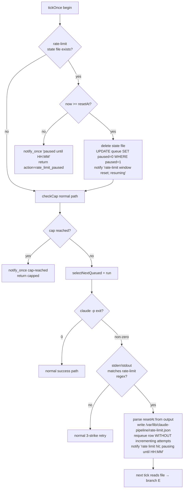

# Rate-limit auto-recovery + Sonnet 4.6 switch + cap-50 + cap-spam fix

## Important environment correction (read first)

This Claude Code on the web session is **NOT** on the Hostinger VPS. Verified:

```
whoami    → root
hostname  → vm
/etc/yash-pipeline → does not exist
systemctl --user → "Failed to connect to bus: No medium found"
```

This is the standard cloud sandbox. I can edit the repo, write/run tests, and open a PR — but I **cannot** `systemctl restart` your live daemons from here. You (or a follow-up CLI session that actually runs on `yash@srv944193`) will need to execute the deploy block at the end. I'll mark that block clearly and write it as copy-paste-runnable commands.

---

## Context — why this change

On 2026-05-25 at ~4 PM ET both bots (`yash-pipeline-orchestrator`, `shivani-pipeline-orchestrator`) exhibited a 3-way production failure that the operator captured live from Telegram:

1. **Silent 5-hour quota exhaustion.** Each `claude -p --model claude-opus-4-7` invocation costs significant Max-subscription quota. After ~10 URLs across both bots, the shared Claude Max account hit its 5-hour usage window and `claude -p` started exiting with code 1. The orchestrator has no detection for this — it treats it as a generic failure (`claude -p exit 1 signal none`), burns all 3 retry attempts back-to-back (each new attempt fails immediately because the window hasn't reset), and marks the queue row `failed`.

2. **Self-DDoS of the daily cap.** `services/cap.mjs` counts both `ok` AND `fail` runs toward the cap. So every rate-limited URL consumes 3 of the 20-per-day budget. ~7 URLs of rate-limit failures = cap full. The cap is hard-coded at `{ dailyMax: 20, weeklyMax: 100 }` in `pipeline-orchestrator.mjs:810` and cannot be raised without a code change.

3. **`⏸️ Cap reached` spam.** `tickOnce` at `pipeline-orchestrator.mjs:218-223` re-emits `formatCapReached` on **every 2-second tick** as long as the queue is non-empty AND the cap is reached. With Sonnet 4.6 + cap 50 this would be less likely, but the spam itself is an unconditional bug that must be fixed — the user reported it firing continuously from 4 PM onward into the next day.

Beyond the bugs, the operator wants three behavior changes:

- **Switch model** to Sonnet 4.6 with extended/adaptive thinking (claude CLI flag `--effort xhigh`, verified present in `claude --help`).
- **Raise cap** to daily 50 / weekly 250 for both bots.
- **Auto-recover** from the 5-hour limit: detect it, pause both queues globally, schedule wake-up at the reset time, auto-unpause, and resume processing. No operator intervention required.

The orchestrator already has the primitives we need: `queue.paused` column + `selectNextQueued` already skips `paused=1` (`services/queue.mjs:68`). We extend that with a tiny on-disk shared state file so both tenant orchestrators see the same pause window.

---

## Architecture — global rate-limit state machine

A single JSON state file at `/var/lib/claude-pipeline/rate-limit.json` (writable by `yash:yash`) is the cross-tenant coordination point. Both orchestrators read it on every tick before doing work and write to it when their own `claude -p` reports a usage-limit exit.



Why a JSON file, not a third SQLite DB or systemd timer:
- Both daemons already poll every 2 s — adding `existsSync` + `JSON.parse` is sub-millisecond.
- Survives daemon restarts (file persists; daemon re-reads on boot).
- Survives reboots (`/var/lib/` is persistent).
- No schema migration, no FK across tenant DBs, no shared-lock cliff.
- The single writer (orchestrator that detected the limit first) is race-tolerant: if both write within the same window, the later write wins and they end up with the same `resetAt` ± seconds; the user-facing pause is still correct.

`notify_once` = module-scoped `Map<string, lastEmittedAt>` keyed by `{tenant, kind, window}` that suppresses re-emits within the same window. Same primitive fixes both the cap-spam bug and the rate-limit-paused spam.

---

## File-by-file changes

### NEW: `services/rate-limit.mjs`

Self-contained module. ~120 lines. Exports:

- `RATE_LIMIT_PATTERNS` — array of regexes for the claude-cli output:
  - `/Claude\s+(AI\s+)?usage limit reached/i`
  - `/your\s+(usage|limit)\s+will reset at\s+([^\n]+)/i`
  - `/5[- ]hour limit/i`
  - `/weekly (usage )?limit/i`
  - `/usage_limit_exceeded/i`
- `detectRateLimit(output: string) → { hit: boolean, resetAt: Date | null, rawHint: string|null }` — runs the regexes, tries to parse a reset time from the "reset at <X>" capture group; falls back to `null` (caller defaults to "5 hours from now").
- `readState(path) → { resetAt: Date, reason: string, setBy: string } | null` — read+parse JSON, return null if missing/corrupt.
- `writeState(path, { resetAt, reason, setBy })` — atomic write (`writeFileSync(path + '.tmp', …); renameSync(.tmp, path)`).
- `clearState(path)` — `unlinkSync` ignoring ENOENT.
- `defaultResetAt(now = Date.now())` — `new Date(now + 5 * 60 * 60 * 1000)` (5-hour Max window).
- `RATE_LIMIT_STATE_PATH` — `process.env.RATE_LIMIT_STATE_PATH || '/var/lib/claude-pipeline/rate-limit.json'`.

### NEW: `services/notify-dedup.mjs`

~40 lines. Exports `createNotifyDedup({ defaultWindowMs = 60_000 })` returning `{ shouldEmit(key, windowMs?): boolean, reset(key?) }`. Backed by `Map<string, number>`. Used in two places:
1. `tickOnce` cap-reached branch — window = current daily/weekly cap window (key `cap:${reason}`).
2. `tickOnce` rate-limit-paused branch — window = until `resetAt` (key `rate_limit:paused`).

### EDIT: `services/cap.mjs`

Make limits env-driven so the operator can change them without a code edit:

```js
export function checkCap(db, limits) {
  const dailyMax = Number(process.env.CAP_DAILY_MAX ?? limits?.dailyMax ?? 50);
  const weeklyMax = Number(process.env.CAP_WEEKLY_MAX ?? limits?.weeklyMax ?? 250);
  // … existing body, with new defaults
}
```

Bumping the hard-coded defaults from 20/100 → 50/250 is the user-requested change; the env vars give the operator an emergency knob to lower it without redeploy.

### EDIT: `services/pipeline-orchestrator.mjs`

Five surgical changes:

1. **Line 702** — switch default model:
   `const claudeModel = process.env.CLAUDE_MODEL || 'claude-sonnet-4-6';`

2. **Line 451-457 `realSpawn`** — append `--effort` and `--fallback-model`:
   ```js
   const claudeArgs = [
     '-p', preamble, '--print', '--dangerously-skip-permissions',
     '--add-dir', projectRoot,
     '--model', claudeModel,
     '--effort', process.env.CLAUDE_EFFORT || 'xhigh',
   ];
   if (process.env.CLAUDE_FALLBACK_MODEL) {
     claudeArgs.push('--fallback-model', process.env.CLAUDE_FALLBACK_MODEL);
   }
   const child = nodeSpawn('claude', claudeArgs, { … });
   ```

3. **Line 810** — drop the hard-coded cap object; `checkCap` now reads env/defaults itself:
   `capLimits: undefined,` (or just remove from the tickOnce call signature).

4. **`tickOnce` (lines 215-228)** — wrap the cap notify with `notifyDedup.shouldEmit('cap:' + cap.reason, windowMs)` so the spam stops. Compute `windowMs` as "millis until end of current day/week (UTC)" so the reminder re-fires once per fresh window. Same primitive applied to the new rate-limit branch.

5. **`tickOnce` (top, before `checkCap`)** — new rate-limit guard:
   ```js
   const rl = readState(RATE_LIMIT_STATE_PATH);
   if (rl) {
     if (Date.now() < rl.resetAt.getTime()) {
       if (notifyDedup.shouldEmit('rate_limit:paused', /*until reset*/)) {
         notify(`⏸️ Claude usage-limit window active until ${rl.resetAt.toISOString()}; queue paused.`);
       }
       return { action: 'rate_limit_paused' };
     }
     // Window elapsed — clear state, unpause all queue rows, notify once
     clearState(RATE_LIMIT_STATE_PATH);
     db.prepare("UPDATE queue SET paused=0 WHERE paused=1").run();
     notify(`▶️ Claude usage-limit window has reset; resuming queue.`);
   }
   ```

6. **`realSpawn` return (line 531-545)** — read the tail of `claude.log` and apply `detectRateLimit`. If `hit`, set extra fields on the return object:
   ```js
   const tail = existsSync(claudeLogPath) ? readFileSync(claudeLogPath,'utf8').slice(-8192) : '';
   const rl = detectRateLimit(tail);
   return { …existing fields, rateLimitHit: rl.hit, rateLimitResetAt: rl.resetAt };
   ```

7. **`tickOnce` failure branch (after the existing `result = await spawn(…)`)** — before incrementing `attempts`, check the rate-limit flag:
   ```js
   if (result.rateLimitHit) {
     const resetAt = result.rateLimitResetAt || defaultResetAt();
     writeState(RATE_LIMIT_STATE_PATH, {
       resetAt, reason: 'claude-cli usage limit',
       setBy: process.env.TENANT || 'yash',
     });
     // Requeue the row WITHOUT consuming an attempt
     db.prepare(`UPDATE queue SET status='queued', assigned_at=NULL WHERE id=?`).run(next.id);
     // Don't write a 'fail' status to runs — write 'rate_limited' so cap.mjs skips it
     updateRunEnd(db, runId, { endedAt, status: 'rate_limited', error: 'usage-limit detected' });
     notify(`⏸️ Claude usage limit hit; pausing until ${resetAt.toISOString()}. Run #${runId} will retry.`);
     return { action: 'rate_limited', runId };
   }
   ```

   And update `services/cap.mjs`'s `CAPPED_STATUSES = ['ok', 'fail']` — `rate_limited` is intentionally excluded so we never burn cap on a quota event.

   `services/db.mjs` schema: extend the `runs.status` column's implicit value set. The schema today has no CHECK constraint on `runs.status`, so this is a code-only change — no migration needed.

### EDIT: `ops/telegram.env.example` and `ops/shivani/telegram.env.example`

Add the new env knobs with their defaults so the operator sees them on first read:

```
# ── Model + thinking budget ──────────────────────────────────────────────────
CLAUDE_MODEL=claude-sonnet-4-6
CLAUDE_EFFORT=xhigh
# Optional: auto-fallback if Sonnet is overloaded (not for usage-limit; for 529s)
# CLAUDE_FALLBACK_MODEL=claude-haiku-4-5-20251001

# ── Cap knobs (override the new 50/250 defaults if needed) ───────────────────
# CAP_DAILY_MAX=50
# CAP_WEEKLY_MAX=250

# ── Rate-limit state file (shared across all tenants on this VPS) ────────────
RATE_LIMIT_STATE_PATH=/var/lib/claude-pipeline/rate-limit.json
```

### EDIT: `services/notifier.mjs` (small)

Add `formatRateLimitPaused({ resetAt })` and `formatRateLimitResumed()` so the strings live with the other formatters.

### Tests to add (matches existing test style under `tests/services/`)

1. `tests/services/rate-limit.test.mjs`
   - `detectRateLimit('… Claude AI usage limit reached. Your limit will reset at 2026-05-26T01:00:00Z …')` → `{ hit: true, resetAt: <Date>, … }`.
   - Two negative samples (generic error text, empty string).
   - `writeState` + `readState` round-trip; `clearState` is idempotent.

2. `tests/services/notify-dedup.test.mjs`
   - First `shouldEmit('cap:daily', 60_000)` → `true`, second within 60 s → `false`, after window → `true` again.

3. `tests/services/orchestrator-rate-limit.test.mjs` (E2E-style with fake spawn)
   - Fake spawn returns `{ exitCode: 1, rateLimitHit: true, rateLimitResetAt: new Date(Date.now()+3600_000) }`.
   - Assert: state file written, queue row back to `queued` with `attempts=0`, runs row `status='rate_limited'`, next `tickOnce` returns `action: 'rate_limit_paused'` and does NOT spawn.
   - Mutate state file `resetAt` to past; next tick clears file, unpauses, returns to normal flow.

4. `tests/services/orchestrator-cap-spam.test.mjs`
   - Backfill 50 `ok` runs; queue 1 row; tick 5 times in a row; assert `notify` was called with cap text **exactly once**.

5. Update existing tests that hard-code `claudeModel: 'claude-opus-4-7'` (orchestrator.test.mjs, orchestrator-retry.test.mjs, orchestrator-logging.test.mjs, resume-inflight.test.mjs, shivani-3strike-retry.e2e.mjs, shivani-delivery.e2e.mjs, shivani-shutdown-interrupt.test.mjs) — change literal to the new default OR pass via env. Confirm `test-all.mjs` and `npm run test:services` pass.

### Docs to update

- `.claude/skills/yash-pipeline-autonomous-agent/SKILL.md` — model + new env knobs in §architecture paragraph; add rate-limit row to the failure-playbook table.
- `.claude/skills/shivani-pipeline-autonomous-agent/SKILL.md` + `OPERATIONS.md` — same updates; note the shared rate-limit JSON file is cross-tenant.
- `OPERATIONS.md` (repo root) — add a §"Rate-limit auto-recovery" section describing the state file location, the manual override (`rm /var/lib/claude-pipeline/rate-limit.json` + `systemctl --user restart pipeline-orchestrator`), and the metrics (`journalctl … grep rate_limit`).

---

## Verification

### Local (in this sandbox, before push)

```bash
cd /home/user/repo
node --experimental-sqlite tests/services/rate-limit.test.mjs
node --experimental-sqlite tests/services/notify-dedup.test.mjs
node --experimental-sqlite tests/services/orchestrator-rate-limit.test.mjs
node --experimental-sqlite tests/services/orchestrator-cap-spam.test.mjs
node test-all.mjs                    # full repo gate (63+ checks)
npm test 2>&1 | tail -30             # if package.json has a test script
```

Expected: all green; no regression in existing `orchestrator*.test.mjs`.

### Live (on yash@srv944193 — operator runs this block)

```bash
# 1. Pull merged main
ssh yash@srv944193
cd /yash-superClaudeHuman/projects/yash-ai-automation-career
git pull origin main

# 2. Create shared rate-limit state dir
sudo mkdir -p /var/lib/claude-pipeline
sudo chown yash:yash /var/lib/claude-pipeline
sudo chmod 755 /var/lib/claude-pipeline

# 3. Add the new env vars to BOTH env files
sudo $EDITOR /etc/yash-pipeline/agent.env       # add CLAUDE_MODEL/EFFORT/RATE_LIMIT_STATE_PATH
sudo $EDITOR /etc/shivani-pipeline/agent.env    # same

# 4. Restart both orchestrators (listeners don't read these vars)
systemctl --user restart pipeline-orchestrator shivani-pipeline-orchestrator

# 5. Verify clean boot
journalctl --user -u pipeline-orchestrator -n 30 --no-pager | grep -E 'bot_online|claude_model'
journalctl --user -u shivani-pipeline-orchestrator -n 30 --no-pager | grep -E 'bot_online|claude_model'
# Expected: claude_model=claude-sonnet-4-6 in both

# 6. Canary: send /add <a-known-good-URL> to each bot
# Expected: ~6-min cycle (Sonnet is faster than Opus), success notification, PDF delivered.

# 7. Force-simulate rate-limit (smoke test the new branch — optional)
echo '{"resetAt":"'"$(date -u -d '+5 min' +%Y-%m-%dT%H:%M:%SZ)"'","reason":"smoke-test","setBy":"manual"}' > /var/lib/claude-pipeline/rate-limit.json
# Within 2 s: both Telegram chats should get "⏸️ Claude usage-limit window active until …" exactly once.
# After 5 min: both should get "▶️ Claude usage-limit window has reset; resuming queue." exactly once.
```

### Rollback (if anything breaks)

```bash
# Step A: revert PR commit
cd /yash-superClaudeHuman/projects/yash-ai-automation-career
git log --oneline -5
git revert <merge-sha>
git push origin main

# Step B: re-pull and restart
ssh yash@srv944193
cd /yash-superClaudeHuman/projects/yash-ai-automation-career
git pull
systemctl --user restart pipeline-orchestrator shivani-pipeline-orchestrator

# Step C: clear any lingering rate-limit state
rm -f /var/lib/claude-pipeline/rate-limit.json
```

The change is additive — code defaults preserve old behavior when the new env vars are unset (`CLAUDE_MODEL` already env-driven, new `CLAUDE_EFFORT` only adds a CLI flag, `RATE_LIMIT_STATE_PATH` only triggers when a state file actually exists). Cap default change (20→50) is the one breaking semantic — if the operator wants the old value, they set `CAP_DAILY_MAX=20` in both env files before restart.

---

## Order of execution

1. Write `services/rate-limit.mjs`, `services/notify-dedup.mjs`, plus their unit tests. Run the two unit-test files in isolation; iterate until green.
2. Edit `services/cap.mjs` (env-driven defaults) and its test. Green.
3. Edit `services/notifier.mjs` (two new formatters). Green.
4. Edit `services/pipeline-orchestrator.mjs` — the 7 surgical edits in §"file-by-file". Update existing test fixtures (`claude-opus-4-7` → `claude-sonnet-4-6`). Run the full `tests/services/` and `tests/e2e/` directories.
5. Edit the two env example files; edit the three skill/ops docs.
6. `node test-all.mjs` → all green.
7. Commit with two commits (1: services + tests; 2: env templates + docs) so a reviewer can see the surface-area split. Open PR with the failure modes + the deploy block above in the body.
8. After PR is merged on `main`, ping the operator to run the live-deploy block.
